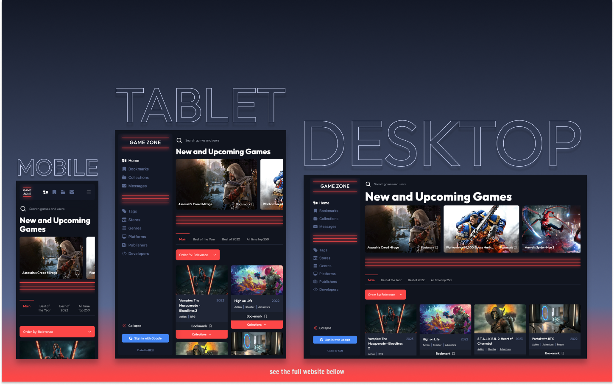

# Game-Zone

## Table of contents

- [Overview](#overview)
  - [The challenge](#the-challenge)
  - [Screenshot](#screenshot)
  - [Links](#links)
- [My process](#my-process)
  - [Built with](#built-with)
  - [What I learned](#what-i-learned)
  - [Continued development](#continued-development)
  - [Useful resources](#useful-resources)
- [Author's Links](#authors-links)

## Overview

### The challenge

Users should be able to:

- Add/Remove games to their bookmarks
- Create private and public collections
- Be able to follow and unfollow other users
- Add/Remove games to their created collection
- Search for relevant games and users on all pages
- See hover states for all interactive elements on the page
- View the optimal layout for the app depending on their device's screen size
- If the collection is public it should appear in users' page and be visible for others
- Once the user follow other user ther should be able to have one-on-one chat in Messages page
- Navigate between Home, Bookmarks, Collections, Messages, Users' Profile and other dynamic routes
- **Bonus**: Build this project as a full-stack application

### Screenshot

### Links

- Live Site URL: [https://game-zone-kens-visuals.vercel.app/](https://game-zone-kens-visuals.vercel.app/)
- Solution URL: [TO_BE_UPDATED](TO_BE_UPDATED)

## My process

### Built with

    

### What I learned

Well well well, looks like I've got another project to add to my portfolio. This one's a doozy, let me tell you. When I first started, I didn't have a clue how much work was ahead of me. But, as they say, ignorance is bliss. And I must admit, I'm feeling pretty pleased with myself now that it's all said and done.

I wanted this project to be the epitome of a social media platform for gamers. And I daresay I've succeeded in that regard. I used some new toys in this project, like React Query. It's a real treat to work with. I also got to flex my muscles with Firebase and Framer Motion. I also was able to deepen my understanding of TypeScript. I can honestly say that this project took my skills to a whole new level.

Now, I'm not one to rest on my laurels. I've got plans for this project, big plans. More functionality, more improvements, you name it. I'm not done yet. And let me tell you, it wasn't always going to be a platform for gamers. Oh no, this project started as a social media site for book lovers. But I soon discovered that the books API I was hoping to use just wasn't up to snuff. So, I pivoted and here we are.

In conclusion, this project has been one wild ride. And I'm thrilled with the end result. It's proof of my prowess as a web developer, and I'm eager to take on more challenges like this one in the future.

### Useful resources

- [rawg.io](https://rawg.io/apidocs) - RAWG API is a powerful tool for working with video games data that was used in this project
- [React Query Firebase](https://react-query-firebase.invertase.dev/) - React Query Firebase provides a set of easy to use hooks for common Firebase usecases. Each hook wraps around React Query, allowing to easily integrate the hooks into a new or existing project, whilst enjoying the powerful benefits React Query offers.
- [Flowbite](https://flowbite.com/docs/getting-started/introduction/) - Flowbite is an open-source library of UI components based on the utility-first Tailwind CSS framework featuring dark mode support, a Figma design system, and more.
- [Mastering data fetching with React Query and Next.js](https://prateeksurana.me/blog/mastering-data-fetching-with-react-query-and-next-js/) - Really cool article that helped me to get started with Next.JS and React Query.

## Author's Links

- Medium - [@kens_visuals](https://medium.com/@kens_visuals)
- CodePen - [@kens-visuals](https://codepen.io/kens-visuals)
- Codewars - [@kens_visuals](https://www.codewars.com/users/kens_visuals)
- Frontend Mentor - [@kens-visuals](https://www.frontendmentor.io/profile/kens-visuals)
